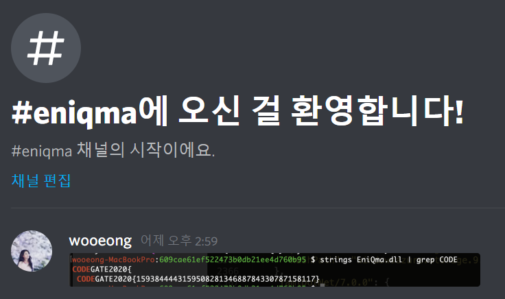

# MIC Check

```py
import zlib
from itertools import product

def make_string(length=5, table=''.join([chr(i) for i in range(32,127)])):
    ret_value = []
    for length in range(length, length+1):
            to_attempt = product(table, repeat=length)
            for attempt in to_attempt:
                    ret_value.append(''.join(attempt))
    return ret_value

for i in make_string(3):
    x = i
    ret = int("0b"+"1"*32, 2) - zlib.crc32(x.encode())
    if ret == 3063077912:
        print("Good !!!!")
        print(i)
        exit()

# MIC
```

# EniQma
`strings` is the best hacking tool !



# EINEG

```
$ ./eineg 
Hi, I'm EINEG. What you want?
galf
I told it to you.
```

```
$ nc -lp 31337
CODEGATE2020{I_w1sh_COVID_19_ends_s00oon}

```

# patternmania
`longest common substring`

http://byronknoll.appspot.com/lcs.html

# gaemgam
`strings` is the best hacking tool 2 !
```bash
$ strings assets/www/data.js | grep CODEGATE
CODEGATE2020{W3_ar3_playing_CTF_gam3}
```

# cloud9

[@mathboy](https://twitter.com/mathboy770) solved it.

```
sage: E = EllipticCurve(Zmod(n), [a, b])
sage: P = E(47910641451748378331130770695997575849473812168411054327879314811238355379239969045901763346180001410359592579938470697600408276488459
....: 93882710813263422518, 2007135516277895026771627676893419200766568709594031697039637947675097596595809713825936430608820664600227626467013163
....: 201670055105153466868380086912003923)
sage: Q = E(29066609154594245150402770930026836425894885071128051397263869389338809295065011850828194300938128255401333256400974131004498773106694
....: 18449600698325701077, 3812143203765395705358551712573539116980648501774991245491977901798688330759954052153901303962483747022229555022370548
....: 381218346760417689877969168781021420)
sage: P * d == Q
True
sage: 
26599269740846508910738525169119527044
CODEGATE2020{Here_comes_the_crypto_genius}
```
